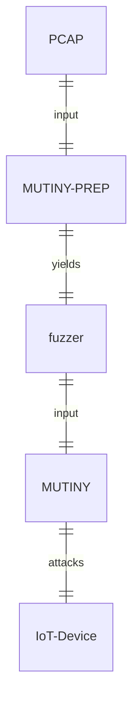
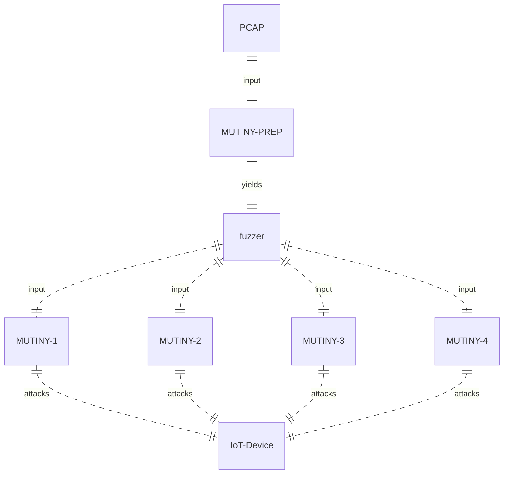

# HelloWorld

```mermaid
erDiagram 
          PCAP ||--|| MUTINY-PREP : input
           MUTINY-PREP ||--|| fuzzer : yields
          fuzzer ||--|| MUTINY : input
          MUTINY ||--|| IoT-Device : attacks
         
```

```mermaid
erDiagram 
          PCAP ||--|| MUTINY-PREP : input
           MUTINY-PREP ||..|| fuzzer : yields
          fuzzer ||..|| MUTINY-1: input
          fuzzer ||..|| MUTINY-2: input
          fuzzer ||..|| MUTINY-3: input
          fuzzer ||..|| MUTINY-4: input
          MUTINY-1 ||..|| IoT-Device : attacks
          MUTINY-2 ||..|| IoT-Device : attacks
          MUTINY-3 ||..|| IoT-Device : attacks
          MUTINY-4 ||..|| IoT-Device : attacks
         
```       
          
          

     
